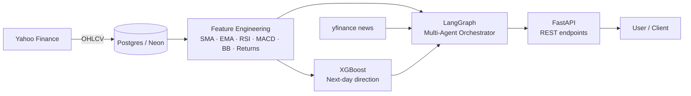
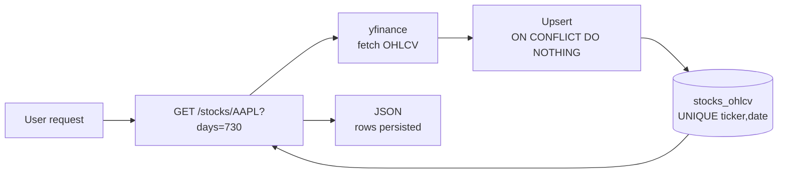
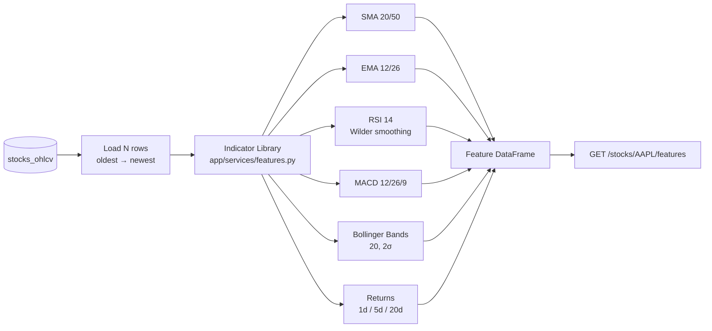
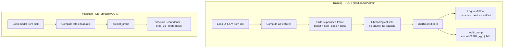
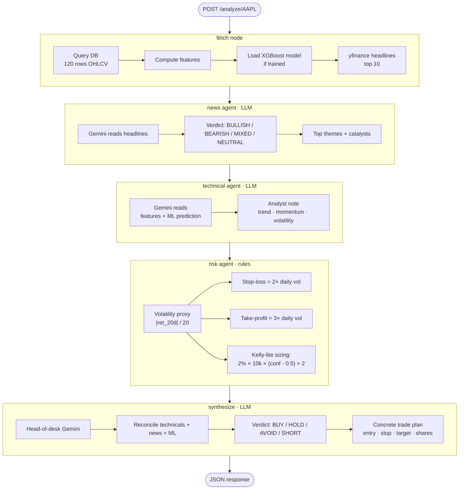
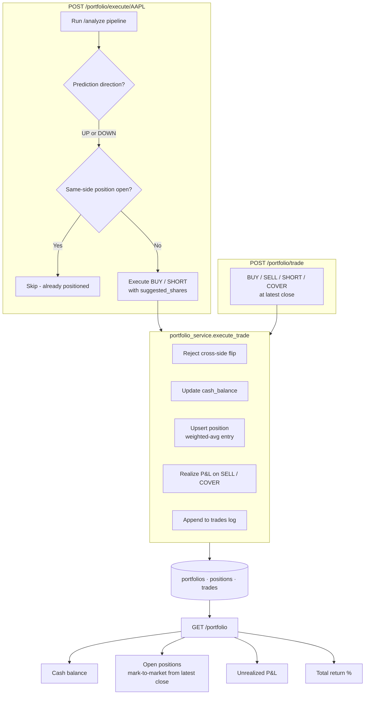

# equity-agent

Multi-agent AI platform for equity research, combining an **XGBoost ML brain** with a **LangGraph LLM brain** (Technical + News + Risk agents) that collaborate on stock analysis.

**Live demo:** https://equity-agent-2lpa.onrender.com · **API docs:** https://equity-agent-2lpa.onrender.com/docs

---

## Overall Architecture



The system is a **modular monolith**: one FastAPI container, but organized as independent services (data, features, ML, agents) that could be extracted into microservices later. ML alone is commodity; multi-agent LLM analysis on top of ML is the differentiator.

---

## Phase 1 — Data Ingestion



Idempotent ingest: repeat calls are safe, no duplicates. Postgres unique constraint on `(ticker, date)` enforces this at the DB layer. Alembic manages the schema.

**Endpoints:** `GET /stocks/{ticker}?days=N`, `GET /stocks/{ticker}/history?limit=N`

---

## Phase 2 — Feature Engineering



Pure pandas — no I/O, no DB. **Shared by both the ML pipeline and the Technical agent** so indicator logic never drifts between them.

**Endpoint:** `GET /stocks/{ticker}/features?days=N`

---

## Phase 3 — XGBoost ML Pipeline



Chronological split is critical — random shuffle would leak future data into training.

**Phase 7 improvements** (after 10-ticker bootstrap revealed a systemic DOWN-bias — 9/10 predictions were SHORT):
- **5-day target** instead of 1-day. Daily direction is near-random walk; 5-day trends carry real signal.
- **`scale_pos_weight`** computed from training class balance so the model can't collapse to the majority class.
- **`atr_14` feature** (Wilder ATR) added — real volatility from OHLC that captures gaps, unlike the earlier `|ret_20d|/20` proxy.
- **`bb_mid` dropped** — zero XGBoost importance, collinear with `sma_20`.

**Endpoints:** `POST /predict/{ticker}/train`, `GET /predict/{ticker}`

---

## Phase 4 & 5 — LangGraph Multi-Agent Orchestrator

The heart of the system. Every `/analyze/{ticker}` call runs this StateGraph:



**Why this works:** each agent has a narrow job with a targeted prompt. The synthesizer sees all three outputs plus the raw ML signal, and calls out conflicts explicitly (e.g. bullish technicals vs bearish news → often surfaces the more informative signal wins). Rule-based risk agent stays deterministic — position sizing shouldn't be an LLM guess.

**Endpoint:** `POST /analyze/{ticker}`

### Example verified output (AAPL, 2026-07-14)

- **News agent:** BEARISH — KeyBanc downgrade to Underweight, iPhone weakness cited, retail investors cashing out
- **Technical agent:** Bullish price above all MAs and momentum positive, but price near upper Bollinger Band flags reversal risk
- **ML prediction:** DOWN with 71.6% confidence
- **Risk agent:** stop-loss 318.47, take-profit 310.59, 27 shares, $8,513 notional
- **Final synthesis:** SHORT with medium-high confidence — synthesizer explicitly reconciled the bullish technicals against bearish news + bearish ML

---

## Phase 6 — Paper Trading Portfolio

Closes the loop from advisory (`/analyze` produces text + numbers) to execution + P&L tracking. **$1M virtual starting capital** — no real money at risk, but real market data and real system decisions.



**Key semantics:**
- **BUY** — opens/adds LONG; cash decreases; weighted-avg entry price maintained
- **SELL** — closes (partial or full) LONG; realizes `(price - avg_entry) × shares`
- **SHORT** — opens/adds SHORT; cash *increases* (proceeds credited); weighted-avg entry
- **COVER** — closes SHORT; realizes `(avg_entry - price) × shares`
- Cross-side flips (e.g. BUY while SHORT open) are rejected — must close first

**Endpoints:** `GET /portfolio` · `POST /portfolio/reset` · `POST /portfolio/trade` · `POST /portfolio/execute/{ticker}` · `GET /portfolio/trades`

---

## Tech Stack

| Layer | Choice | Why |
|-------|--------|-----|
| API | FastAPI + Pydantic v2 | Async, typed, auto-docs at `/docs` |
| DB | Postgres (Neon) + SQLAlchemy + Alembic | Managed Postgres free tier + typed ORM + versioned migrations |
| ML | XGBoost + scikit-learn + MLflow | Tabular workhorse + experiment tracking |
| Agents | LangGraph + langchain-google-genai | Explicit state machine, Gemini 2.5 Flash as LLM |
| Data | yfinance + pandas | Zero-key data source for OHLCV + news |

## Local Setup

```powershell
# Clone
git clone https://github.com/dheepakkaran/equity-agent.git
cd equity-agent

# Virtual environment
python -m venv venv
.\venv\Scripts\Activate.ps1

# Install dependencies
pip install -r requirements.txt

# Configure
copy .env.example .env
# Fill in DATABASE_URL and GEMINI_API_KEY in .env

# Run migrations
alembic upgrade head

# Start server
uvicorn app.main:app --reload
```

Open `http://localhost:8000/docs` for interactive API documentation.

## API Endpoints

| Method | Path | Purpose |
|--------|------|---------|
| GET | `/health` | Liveness check |
| GET | `/stocks/{ticker}?days=N` | Fetch OHLCV from Yahoo → persist to Postgres |
| GET | `/stocks/{ticker}/history?limit=N` | Read persisted OHLCV |
| GET | `/stocks/{ticker}/features?days=N` | Compute technical indicators |
| POST | `/predict/{ticker}/train` | Train XGBoost, log to MLflow |
| GET | `/predict/{ticker}` | Predict next-day direction |
| POST | `/analyze/{ticker}` | Full multi-agent analysis + trade plan |
| GET | `/portfolio` | Current cash, positions, unrealized P&L, total return |
| POST | `/portfolio/reset` | Wipe positions/trades, restore $1M cash |
| POST | `/portfolio/trade` | Manual BUY/SELL/SHORT/COVER at latest close |
| POST | `/portfolio/execute/{ticker}` | Auto-execute the agent's recommended trade |
| GET | `/portfolio/trades` | Trade history (optionally filter by ticker) |
| POST | `/portfolio/snapshot` | Capture today's portfolio state (idempotent per day) |
| GET | `/portfolio/history?days=N` | Equity-curve data + period return |
| POST | `/portfolio/enforce-stops` | Close positions that crossed stop_loss or take_profit |
| POST | `/portfolio/auto-build?budget=X&max_positions=5` | Reset + auto-buy top N high-confidence UP picks |
| GET | `/portfolio/accuracy` | Model track record: overall %, reward points, per-ticker breakdown |
| GET | `/scan?budget=X` | Rank affordable stocks by expected 5-day gain (137-ticker universe) |

## Roadmap

- [x] OHLCV ingestion (idempotent upsert)
- [x] Technical indicators (SMA/EMA/RSI/MACD/BB/returns)
- [x] XGBoost next-day direction prediction with MLflow
- [x] LangGraph multi-agent: Technical + Risk + Synthesis
- [x] News agent (yfinance headlines + Gemini sentiment)
- [x] Paper trading portfolio ($1M virtual capital, auto-execute agent recommendations)
- [x] Model improvements (5-day target, class balance via `scale_pos_weight`, ATR feature, drop `bb_mid`)
- [x] Daily portfolio snapshots (equity curve + period return over any window)
- [x] Stop-loss / take-profit auto-enforcement (autonomous position closure)
- [x] Daily automation via GitHub Actions cron (ingest + enforce + snapshot, no server required)
- [x] Deployment via Docker + Render.com (Dockerfile ready, `${PORT}` respected, `--proxy-headers` set)
- [x] Configurable capital ($100–$100k, auto-scaling risk sizing for demo budgets)
- [x] 137-ticker universe with affordability-filtered scan endpoint
- [x] Prediction tracking + reward points (10 per correct hit + high-confidence bonuses)
- [x] Auto-build portfolio (one click → confidence-weighted allocation across top picks)
- [ ] Langfuse LLM observability
- [ ] Retraining + drift monitoring (Evidently)
- [ ] pgvector for news RAG
- [ ] Tests + CI (pytest + GitHub Actions)
- [ ] HuggingFace Spaces deployment

## License

MIT
